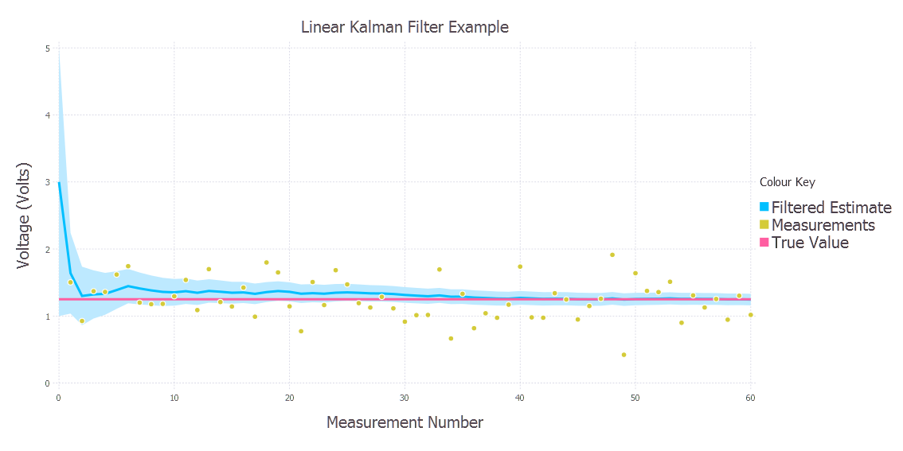
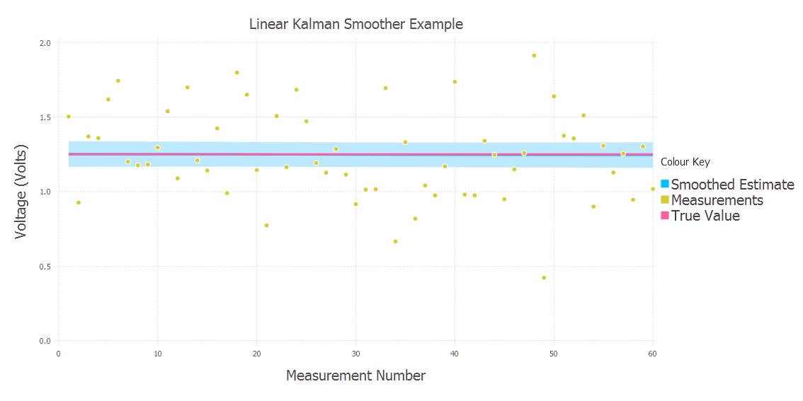

State Space Examples List
=========================

###Introduction

The *examples* directory contains scripts and IJulia notebooks for each Kalman Filter example. The **scripts can be run as they are** to produce the results and are fully commented as standalone examples. The IJulia notebook for the corresponding example exists to provide a bit more context to the problem and guide the user through the problem setup and how to solve the problem using the StateSpace.jl package.

###Examples

#####Basic Linear Kalman Filter and smoother - Voltage Example

The [script](https://github.com/JonnyCBB/StateSpace.jl/blob/master/examples/LinearKalmanFilter_VoltageExample.jl) and the [notebook](https://github.com/JonnyCBB/StateSpace.jl/blob/master/examples/LinearKalmanFilter_VoltageExample.ipynb) describes a problem where a constant true voltage is measured with a noisy voltmeter. The results of the filter can be seen below:  The StateSpace.jl package also allows to perform smoothing and the same example [script](https://github.com/JonnyCBB/StateSpace.jl/blob/master/examples/LinearKalmanFilter_VoltageExample.jl) and [notebook](https://github.com/JonnyCBB/StateSpace.jl/blob/master/examples/LinearKalmanFilter_VoltageExample.ipynb) demonstrates how to perform smoothing: 

#####Linear Kalman Filter with control input - Canonball Example

The [script](https://github.com/JonnyCBB/StateSpace.jl/blob/exampleREADME/examples/LinearKalmanFilterControlInput_CanonBallExample.jl) and the [notebook](https://github.com/JonnyCBB/StateSpace.jl/blob/exampleREADME/examples/LinearKalmanFilterControlInput_CanonBallExample.ipynb) describes a problem where a canonball is fired from a canon at a particular angle and velocity from the ground. The goal is to track the X and Y position of the ball as it travels through the air. This example produces the following result 

#####Extended Kalman Filter - Logistic Growth Example

The [script](https://github.com/JonnyCBB/StateSpace.jl/blob/exampleREADME/examples/ExtendedKalmanFilter_LogisticGrowthExample.jl) and the [notebook](https://github.com/JonnyCBB/StateSpace.jl/blob/exampleREADME/examples/ExtendedKalmanFilter_LogisticGrowthExample.ipynb) describes a problem where a population evolves via the logistic growth law (sigmoid/S-shaped curve) so this is a non-linear example. We want to track the population over time given that we have noisy measurements of it. We also want to determine the growth rate even though we don't have any observations of the growth rate. These results can be see below for the population  and the growth rate 
